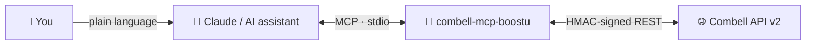

# 🔗 BoostU Combell MCP

### The open-source Combell MCP server. Manage your domains, DNS, hosting, mail and databases from Claude and other AI assistants, in plain language. 🤖

[](https://github.com/boostuagency/combell-mcp-boostu/actions/workflows/ci.yml)
[](https://www.npmjs.com/package/combell-mcp-boostu)
[](https://nodejs.org)
[](https://modelcontextprotocol.io)
[](https://www.npmjs.com/package/combell-mcp-boostu)
[](LICENSE)
[](https://boostu.be)
[](https://combell-mcp.boostu.be)

> ### Prefer not to self-host?
> Use the managed, always-on edition at **[combell-mcp.boostu.be](https://combell-mcp.boostu.be)**: paste your Combell API key once, magic-link login, and a one-click connector for Claude. Free during the preview, paid plans after.
>
> This repository is the open-source MCP server itself: run it locally with your own Combell API key. The hosted edition adds multi-tenant authentication, a dashboard, usage insights and managed credential storage on top of the same server.

---

## 💡 What is this?

`combell-mcp-boostu` is a [Model Context Protocol](https://modelcontextprotocol.io) server that exposes the [Combell API v2](https://api.combell.com/v2/documentation) to AI assistants such as Claude Desktop, Claude Code, Cursor and Windsurf. It provides 74 tools spanning the public Combell surface: accounts and servicepacks, domain names, DNS records, Linux and Windows hosting, scheduled tasks, SSH keys, mailboxes and mail zones, MySQL databases and users, and SSL certificates. Point your AI at it and manage your hosting through natural language.

| | Self-host (this repo) | Managed ([boostu.be](https://combell-mcp.boostu.be)) |
|---|---|---|
| **Price** | Free, MIT-licensed | Free preview, then paid |
| **Setup** | Create an API key in My Combell, run via `npx` | Copy one connector URL into Claude |
| **Credentials** | You manage `.env` and the IP whitelist | Encrypted at rest, one IP to whitelist |
| **Best for** | Developers and self-hosters | Non-technical teams |

---

## 🔌 How it works



You ask Claude in plain language. Claude calls this MCP server, which signs every request with your Combell API key and secret (HMAC-SHA256) and runs the matching API call. Your data stays at Combell; this server only brokers the calls.

> Use the outline button at the top-right of this file to jump to any section.

---

## ✨ Highlights

- 🌐 **Domains**: list and inspect domain names, change name servers, toggle renewal, register and transfer
- 🧭 **DNS**: list, create, update and delete A, AAAA, CNAME, MX, TXT, SRV, CAA, ALIAS and TLSA records
- 🐧 **Linux hosting**: PHP version, memory limit and APCu, GZIP, FTP, subsites, host headers, HTTP/2, Let's Encrypt and HTTPS redirect
- ⏰ **Scheduled tasks and SSH**: manage cron jobs and SSH keys per hosting
- ✉️ **Mail**: mailboxes (create, password, auto-reply, auto-forward), aliases, catch-all, anti-spam and SMTP domains
- 🗄️ **MySQL**: databases and users, including rights and passwords
- 🔒 **SSL**: certificates and certificate requests, with the domain validation steps
- 🔐 **HMAC authentication done right**: lowercased method and path, uppercase percent-encoding, nonce and timestamp, MD5 body hash
- 🧩 **Selectable tool groups**: load only the groups you need via `COMBELL_TOOLS` to keep your assistant's context lean
- 🏷️ **Tool annotations**: every tool declares whether it is read-only, idempotent or destructive, so hosts can ask for confirmation where it matters

---

## 🚀 Quick Start

### Run without installing

```bash
npx combell-mcp-boostu
```

### Global install

```bash
npm i -g combell-mcp-boostu
combell-mcp-boostu
```

### Claude Desktop

Add to `~/Library/Application Support/Claude/claude_desktop_config.json` (macOS) or `%APPDATA%\Claude\claude_desktop_config.json` (Windows):

```json
{
  "mcpServers": {
    "combell": {
      "command": "npx",
      "args": ["-y", "combell-mcp-boostu"],
      "env": {
        "COMBELL_API_KEY": "your-api-key",
        "COMBELL_API_SECRET": "your-api-secret"
      }
    }
  }
}
```

### Claude Code

Add to your project's `.mcp.json` or `~/.claude/mcp.json`:

```json
{
  "mcpServers": {
    "combell": {
      "command": "npx",
      "args": ["-y", "combell-mcp-boostu"],
      "env": {
        "COMBELL_API_KEY": "your-api-key",
        "COMBELL_API_SECRET": "your-api-secret"
      }
    }
  }
}
```

Or from the terminal:

```bash
claude mcp add combell -e COMBELL_API_KEY=your-api-key -e COMBELL_API_SECRET=your-api-secret -- npx -y combell-mcp-boostu
```

### Cursor

Add to `.cursor/mcp.json` in your project root (or the global `~/.cursor/mcp.json`):

```json
{
  "mcpServers": {
    "combell": {
      "command": "npx",
      "args": ["-y", "combell-mcp-boostu"],
      "env": {
        "COMBELL_API_KEY": "your-api-key",
        "COMBELL_API_SECRET": "your-api-secret"
      }
    }
  }
}
```

### Windsurf

Add to `~/.codeium/windsurf/mcp_config.json`:

```json
{
  "mcpServers": {
    "combell": {
      "command": "npx",
      "args": ["-y", "combell-mcp-boostu"],
      "env": {
        "COMBELL_API_KEY": "your-api-key",
        "COMBELL_API_SECRET": "your-api-secret"
      }
    }
  }
}
```

---

## 🔐 Authentication

You need two env vars: `COMBELL_API_KEY` and `COMBELL_API_SECRET`. Generate them in **My Combell > API** (the API section of your Combell control panel).

Combell restricts API access **per IP address**: add the public IP address (or range) of the machine that runs this server to the whitelist in the same API section, otherwise every call answers `401`.

The API uses HMAC authentication; there is no OAuth flow and no token rotation, so nothing has to be persisted between restarts. For the details (how the signature is built, IP whitelisting, troubleshooting) see [docs/AUTHENTICATION.md](docs/AUTHENTICATION.md).

---

## ⚙️ Configuration

### Environment variables

| Name | Required | Description |
|------|----------|-------------|
| `COMBELL_API_KEY` | Yes | API key from My Combell > API |
| `COMBELL_API_SECRET` | Yes | API secret from My Combell > API; used only to sign requests, never sent |
| `COMBELL_TOOLS` | No | Comma-separated list of tool group keys to enable. When unset, all 12 groups are loaded. |
| `COMBELL_API_BASE_URL` | No | Override the API base URL (default `https://api.combell.com`) |

### Selective tool groups

Use `COMBELL_TOOLS` to limit which tool groups are registered. This is useful when you want to keep the assistant's tool list small or restrict access to certain areas of your hosting.

```bash
COMBELL_TOOLS=domains,dns,mailboxes
```

Full list of group keys:

| Key | What it covers |
|-----|---------------|
| `accounts` | Accounts (instances of a servicepack) and servicepacks |
| `provisioning` | Provisioning jobs (background operations) |
| `domains` | Domain names: detail, register, transfer, name servers, renewal |
| `dns` | DNS records |
| `linuxHostings` | Linux hosting: PHP, GZIP, FTP, subsites, host headers, HTTP/2, SSL settings |
| `scheduledTasks` | Cron jobs on Linux hostings |
| `ssh` | SSH access and keys |
| `windowsHostings` | Windows hosting (read-only) |
| `mailboxes` | Mailboxes |
| `mailZones` | Aliases, catch-all, anti-spam, SMTP domains |
| `mysql` | MySQL databases and users |
| `ssl` | SSL certificates and certificate requests |

---

## 🧰 Available Tools

Tools that purchase something or cannot be undone say so in their description (`SIDE EFFECT:`) and carry the `destructiveHint` annotation.

### Accounts and servicepacks

| Tool | Description |
|------|-------------|
| `combell_accounts_list` | List accounts, filtered by asset type or identifier |
| `combell_accounts_get` | Get an account with its servicepack and addons |
| `combell_accounts_create` | Create an account for a servicepack (orders a product; returns a provisioning job) |
| `combell_servicepacks_list` | List the servicepacks on your reseller contract |

### Provisioning jobs

| Tool | Description |
|------|-------------|
| `combell_provisioning_jobs_get` | Poll a provisioning job until it reports finished, with links to the created resources |

### Domains

| Tool | Description |
|------|-------------|
| `combell_domains_list` | List domain names with expiration and renewal state |
| `combell_domains_get` | Domain detail: name servers, registrant, can_toggle_renew |
| `combell_domains_register` | Register an available domain name (purchase) |
| `combell_domains_transfer` | Transfer a domain name with its authorization code (purchase) |
| `combell_domains_set_nameservers` | Replace the name servers of a domain |
| `combell_domains_set_renew` | Enable or disable automatic renewal |

### DNS records

| Tool | Description |
|------|-------------|
| `combell_dns_records_list` | List records, optionally filtered by type, name or SRV service |
| `combell_dns_records_get` | Get a record by id |
| `combell_dns_records_create` | Create a record (A, AAAA, CNAME, MX, TXT, SRV, CAA, ALIAS, TLSA) |
| `combell_dns_records_update` | Update a record: reads it first and changes only the fields you pass |
| `combell_dns_records_delete` | Delete a record |

### Linux hostings

| Tool | Description |
|------|-------------|
| `combell_linux_hostings_list` | List Linux hostings |
| `combell_linux_hostings_get` | Hosting detail: usage, IP, FTP/SSH, PHP version, sites, databases |
| `combell_linux_hostings_php_versions` | Available PHP versions |
| `combell_linux_hostings_set_php_version` | Change the PHP version |
| `combell_linux_hostings_set_php_memory_limit` | Set the PHP memory limit |
| `combell_linux_hostings_set_php_apcu` | Enable/disable APCu and set its size |
| `combell_linux_hostings_set_gzip` | Enable/disable GZIP compression |
| `combell_linux_hostings_set_ftp` | Enable/disable FTP |
| `combell_linux_hostings_subsites_create` | Create a subsite |
| `combell_linux_hostings_subsites_delete` | Delete a subsite |
| `combell_linux_hostings_host_headers_create` | Add a host header (alias domain) to a site |
| `combell_linux_hostings_set_http2` | Enable/disable HTTP/2 on a site |
| `combell_linux_hostings_set_letsencrypt` | Enable/disable Let's Encrypt for a hostname |
| `combell_linux_hostings_set_https_redirect` | Enable/disable the HTTP to HTTPS redirect for a hostname |

### Scheduled tasks

| Tool | Description |
|------|-------------|
| `combell_scheduled_tasks_list` | List the cron jobs of a hosting |
| `combell_scheduled_tasks_get` | Get a cron job |
| `combell_scheduled_tasks_create` | Add a cron job |
| `combell_scheduled_tasks_update` | Update a cron job (reads it first, changes only the passed fields) |
| `combell_scheduled_tasks_delete` | Delete a cron job |

### SSH

| Tool | Description |
|------|-------------|
| `combell_ssh_keys_list_all` | All SSH keys on the account with the hostings they are attached to |
| `combell_ssh_set_enabled` | Enable/disable SSH on a hosting |
| `combell_ssh_keys_list` | Keys attached to a hosting |
| `combell_ssh_keys_add` | Attach a public key to a hosting |
| `combell_ssh_keys_delete` | Remove a key (by fingerprint) from a hosting |

### Windows hostings

| Tool | Description |
|------|-------------|
| `combell_windows_hostings_list` | List Windows hostings |
| `combell_windows_hostings_get` | Hosting detail: usage, IP, application pool, sites and bindings |

### Mailboxes

| Tool | Description |
|------|-------------|
| `combell_mailboxes_list` | List the mailboxes of a domain |
| `combell_mailboxes_get` | Mailbox detail with auto-reply and auto-forward |
| `combell_mailboxes_create` | Create a mailbox on a mail zone account |
| `combell_mailboxes_delete` | Delete a mailbox |
| `combell_mailboxes_set_password` | Change a mailbox password |
| `combell_mailboxes_set_auto_reply` | Configure the out-of-office reply |
| `combell_mailboxes_set_auto_forward` | Configure forwarding |

### Mail zones

| Tool | Description |
|------|-------------|
| `combell_mail_zones_get` | Mail zone: accounts, aliases, anti-spam, catch-all, SMTP domains |
| `combell_mail_zones_catch_all_create` | Set a catch-all address |
| `combell_mail_zones_catch_all_delete` | Remove a catch-all address |
| `combell_mail_zones_set_anti_spam` | Set the anti-spam level |
| `combell_mail_zones_aliases_create` | Create an alias |
| `combell_mail_zones_aliases_update` | Replace the destinations of an alias |
| `combell_mail_zones_aliases_delete` | Delete an alias |
| `combell_mail_zones_smtp_domains_create` | Add an extra SMTP domain |
| `combell_mail_zones_smtp_domains_update` | Enable/disable an SMTP domain |
| `combell_mail_zones_smtp_domains_delete` | Remove an SMTP domain |

### MySQL

| Tool | Description |
|------|-------------|
| `combell_mysql_databases_list` | List databases |
| `combell_mysql_databases_get` | Database detail |
| `combell_mysql_databases_create` | Create a database on an account (provisioning job) |
| `combell_mysql_databases_delete` | Delete a database |
| `combell_mysql_users_list` | List the users of a database |
| `combell_mysql_users_create` | Add a (read-only) user |
| `combell_mysql_users_set_status` | Enable/disable a user |
| `combell_mysql_users_set_password` | Change a user's password |
| `combell_mysql_users_delete` | Delete a read-only user |

### SSL

| Tool | Description |
|------|-------------|
| `combell_ssl_certificates_list` | List paid SSL certificates |
| `combell_ssl_certificates_get` | Certificate detail by SHA-1 fingerprint |
| `combell_ssl_certificate_requests_list` | List pending certificate requests |
| `combell_ssl_certificate_requests_get` | Request detail with the domain validations to complete; reports completed/gone |
| `combell_ssl_certificate_requests_create` | Order a certificate from a CSR (purchase) |
| `combell_ssl_certificate_requests_verify` | Ask Combell to verify the domain validations |

---

## 💬 Example Prompts

```
Which of my domains expire in the next 60 days, and is auto-renew on for each of them?
```

```
Show me the DNS records of example.be and add a TXT record on @ with "v=spf1 include:_spf.google.com ~all".
```

```
Point www.example.be to 203.0.113.10 and lower the TTL to 300.
```

```
Which PHP version does example.be run on? Switch it to the latest 8.x that's available.
```

```
Enable Let's Encrypt and the HTTPS redirect for www.example.be.
```

```
Create a mailbox jobs@example.be with a strong password and forward it to hr@example.be, keeping a copy.
```

```
Set an out-of-office on info@example.be until next Monday.
```

```
Add a cron job on example.be that runs /www/cron.php every 15 minutes.
```

```
List the MySQL databases on my account and add a read-only user "reports" to the shop database.
```

```
Add my SSH public key to the hosting of example.be and enable SSH.
```

---

## 🐳 Docker

```bash
docker run --rm \
  -e COMBELL_API_KEY=your-api-key \
  -e COMBELL_API_SECRET=your-api-secret \
  ghcr.io/boostuagency/combell-mcp-boostu
```

Remember to whitelist the container's outbound IP address in My Combell > API.

---

## 🛠️ Development

```bash
# Clone and install
git clone https://github.com/boostuagency/combell-mcp-boostu.git
cd combell-mcp-boostu
npm install

# Run in development mode (no build step required)
npm run dev

# Build
npm run build

# Run tests
npm test

# Type-check only
npm run typecheck
```

---

## 🏗️ Architecture

The core of the server is `createServer` in `src/server.ts`, which is transport-agnostic: it takes a `CombellClient` and registers the enabled tool groups, returning a plain `McpServer` instance that the entry point (`src/index.ts`) wires to a `StdioServerTransport`. Tool logic lives in per-domain modules under `src/tools/`, each using the `defineTool` helper in `src/lib/tool.ts` (shared `try / respond / catch / respondError` and annotations). Paths are built with the `p` tagged template (`src/lib/path.ts`) so every path parameter is percent-encoded. HMAC signing lives in `src/api/auth.ts` and the HTTP client with paging, rate-limit and error handling in `src/api/client.ts`. A hosted, multi-tenant edition of this server is available at [combell-mcp.boostu.be](https://combell-mcp.boostu.be).

---

## ✅ Endpoint Verification

The tools are implemented from the official OpenAPI description of the Combell API v2 and exercised with unit tests against a fake client (exact paths, query strings and bodies). They have not yet been run against a live reseller account from this repository; if an endpoint misbehaves the call fails with the API's own error code and text rather than silently misbehaving. The full endpoint manifest is in [docs/combell-endpoints.md](docs/combell-endpoints.md). The certificate download endpoint (`GET /sslcertificates/{fingerprint}/download`) is deliberately not exposed: it returns a password-protected PFX binary that does not belong in an AI conversation.

---

## 🤝 Contributing

See [CONTRIBUTING.md](CONTRIBUTING.md) for development setup, commit conventions, and instructions on adding new tool groups.

---

## 🔒 Security

Report security vulnerabilities to **nick@boostu.be**; do not open a public issue. See [SECURITY.md](SECURITY.md) for the disclosure policy. Never commit `.env` files to version control.

---

## ⚖️ Disclaimer

This is an independent, community-built integration. It is **not affiliated with, endorsed by, or sponsored by Combell NV**. "Combell" is a trademark of Combell NV and is used here only to describe compatibility. You are responsible for your own use of the Combell API under Combell's terms, including any products the API orders on your behalf.

---

## 📄 License

MIT License. Copyright (c) 2026 BoostU Agency. See [NOTICE](NOTICE).
